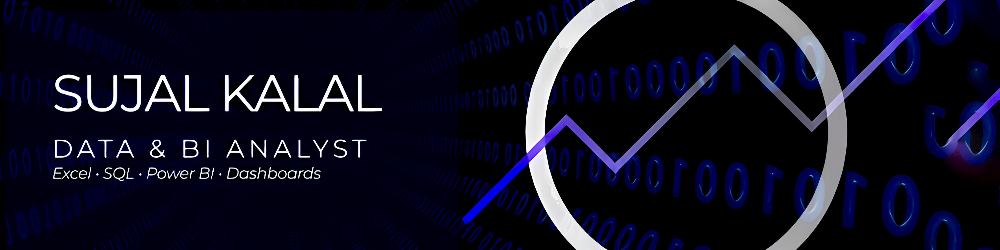

  

# 👋 Hi, I'm Sujal Kalal

🎓 Student | Aspiring **Data / BI Analyst**  
📊 Data Analysis • Dashboards • Insights  
💡 Exploring **AI-assisted product & system design**  
🌐 Strong interest in data-driven web applications

---

## 🧠 About Me
I’m a data-focused student with hands-on experience in **data analysis, reporting, and visualization**, along with exposure to **web applications and AI-assisted development workflows**.

I enjoy working at the intersection of **data, technology, and product thinking** — turning raw data into insights and building systems that support decision-making.

---

## 🛠 Core Skills

### 📊 Data & BI
- Excel (Advanced)
- SQL (MySQL)
- Power BI
- Data cleaning & analysis
- Dashboard creation & reporting

### 🌐 Web & Systems (Supporting Skills)
- React, JavaScript, TypeScript
- HTML, CSS, Tailwind
- Basic backend concepts (Flask, APIs)
- System & product design thinking

### 🤖 AI & Tools
- AI-assisted workflows (responsibly used)
- Prompt-driven prototyping
- Git & GitHub

---

## 📌 Featured Projects

### 🏆 GoldMind Challenge (GMC)
AI-assisted interactive quiz platform prototype inspired by game shows like KBC.  
Focus areas: **product design, UX flow, system architecture, and AI-assisted development**.

🔗 https://github.com/sujalk-0405/goldmind-challenge

---

## 📈 Currently Learning
- Advanced SQL & data modeling  
- Power BI storytelling & performance optimization  
- Practical analytics case studies  
- Building data-backed web interfaces  

---

## 📫 Connect With Me
- 📧 Email: **sujalwrks@gmail.com**
- 💼 LinkedIn: https://www.linkedin.com/in/sujalkalal405
- 📍 Ahmedabad, India
